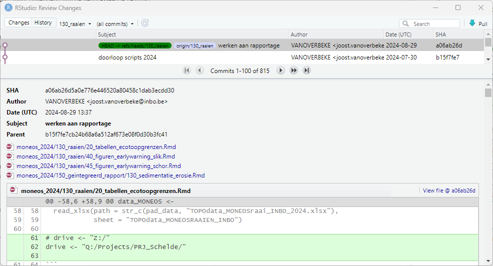

# Useful workflows

-   working in Rstudio : <https://inbo.github.io/git-course/workflow_rstudio.html>
-   collaboration : <https://inbo.github.io/git-course/workflow_review.html>

# Update/add local 'moneos' folder on your pc

## Case 1: you already have a local (git) folder 'moneos' on your computer

-   you have a local folder 'moneos' on your computer from working on the MONEOS report using github in previous year(s)
-   open Rstudio
-   open the project from previous year ('moneos_XXX.Rproj'), where XXX is a previous year

-   in the Git side panel, make sure to select the 'main' branch

-   `pull`  the latest changes from github

## Case 2: you don't have a local (git) folder 'moneos' on your computer

-   create a new project using 'file' -\> 'New Project...' -\> 'version control' -\> 'git'
    -   add '<https://github.com/inbo/moneos>' to 'repository url'
    -   the name of the project (moneos) should appear automatically; if not, fill it in
    -   choose the parent directory for the moneos project directory
    -   create the project

# Open and setup the moneos project for the current year in Rstudio

-   select 'file' -\> 'open project'
-   under the moneos folder, browse to the subfolder for the year of reporting (folder 'moneos_XXX' where XXX is the current year)
-   select the 'moneos_XXX.Rproj' project

## Rstudio settings for the moneos project

-   under 'Tools' -\> 'Global Options'
    -   under 'R markdown'
        -   check that 'evaluate chunks in directory' is set to 'Project' 
-   under 'Tools' -\> 'Project Options'
    -   under 'Build Tools'
        -   check that 'Project Build Tools' is set to ''Website'
        -   check that 'Book output format(s)' is set to 'INBOmd::pdf_report'
        -   check that 'Site directory' is set to '150_geintegreerd_rapport' 

## Add a .Renviron file to the project folder

-   browse to the folder 'moneos/moneos_XXX/000_template', where XXX stands for the year of reporting (e.g. 2022)
-   copy the file '\_.Renviron' to the folder 'moneos/moneos_XXX'
-   rename the '\_.Renviron' under 'moneos/moneos_XXX' to '.Renviron' (remove the underscore '\_')
-   in a text editor or in Rstudio, open the '.Renviron' file and adjust the folder paths to the paths used on your local pc
-   if you are already working in Rstudio, close Rstudio and reopen it

## update the 'main' branch from github

-   select the 'main' branch in Rtudio

-   `pull`  the latest version of 'main' from github.

# Moneos chapter branch

-   For each chapter in the moneos report use a separate branch to work in.
-   In doing so you can work independently of other chapters and avoid interference between work done on different chapters.
-   read <https://inbo.github.io/git-course/workflow_rstudio.html> for more information on working with branches.
-   The chapter branches should be named as follows:
    -   010_inleiding_en_overzicht
    -   030_ecotopen
    -   040_vegetatiekaart
    -   050_hogere_planten
    -   060_sedimentkenmerken
    -   070_macrozoobenthos
    -   080_hyperbenthos
    -   090_vissen
    -   100_watervogels
    -   110_broedvogels
    -   120_zoogieren
    -   130_sedimentatie_erosie
    -   140_slik_schorrand
-   Check in the git panel in Rstudio (or on github) if the chapter branch you want to work in already exists

## Case 1: the moneos chapter branch you intend to work in already exists

-   Select the branch for the chapter you want to work on.
-   `pull`  the latest version of your branch from github.

## Case 2: the moneos chapter branch you intend to work in does not yet exist

-   create a new branch for your chapter 

    -   name the branch according to the list above

# Setup chapter R(md) files

-   While being in your chapter branch:
    -   Under the folder 'moneos/moneos_XXXcurrentYearXXX' create a subfolder for your chapter with the same name as the chapter.
    -   Use this folder to store `.Rmd` files for data management and analysis.
-   The folder 'moneos/moneos_XXXcurrentYearXXX/000_template' contains a number of template/example files for:
    -   data preparation: '10_template_data.Rmd'
    -   analysis and creation of figures and tables: '20_template_analyse.Rmd'
    -   writing the report: '000_template_rapport.Rmd'

## Case 1: scripting files already exist from previous year(s)

### Data management and analysis scripts

-   Go to the folder 'moneos/moneos_ZZZpreviousYearZZZ/chapterYYY', with *ZZZpreviousYearZZZ* the year you want to copy from and *chapterYYY* the chapter of interest.
-   Copy the script files for data management and analysis to the folder 'moneos/moneos_XXXcurrentYearXXX/chapterYYY' you created earlier.\
-   Make sure that the yaml header at the top of these files (between ---) has the correct information. **!!This may change between years!!**
    -   You can check this in the templates for data preparation and analysis in the folder 'moneos/moneos_XXXcurrentYearXXX/000_template'.
    -   Make sure that 'hoofdstuk:' in the yaml header refers to the correct chapter.
    -   You can also specify a different 'title:'.
-   Check that the chunk named '{r pad} corresponds to the examples in the template directory.

### Bookdown script for writing the chapter report

-   Under 'moneos/moneos_XXXcurrentYearXXX/150_geintegreerd_rapport' copy the bookdown script file from a previous year.
-   Make sure the file has the same name as the chapter branch.
-   Check that the chunks at the top of the file (chunks -hoofdstuk to -pad) correspond to the example as given in the '000_template.Rmd' file in the template directory ('moneos/moneos_XXXcurrentYearXXX/000_template'). **!!This may change between years!!**
-   Make sure that the variable 'hoofstuk' in the top chunk is specified correctly for your chapter.
-   Make sure to start the name of all chunks with the number of the corresponding chapter:
    -   {r XXX-chunkname} with XXX the number of the chapter (in the templates this number is 000)

## Case 2: no scripting files exist yet for the current chapter

-   follow the guidelines as above but use the template files in the folder 'moneos/moneos_XXXcurrentYearXXX/000_template' as a starting point.

# Working on a chapter

-   The following applies both for data analysis as for writing the report.
-   Make sure to be in the git branch for the chapter you want to work on.
-   make a habit of `pulling`  potential work of others to the chapter, before you start to apply changes.
    -   In doing so, you are sure to work on the latest version.
    -   A good habit is to do this daily.
-   On a regular basis (e.g. daily, at the end of the day) `commit`  and `push`  your changes to github.
    -   In doing so, you ensure that they are visible to coworkers, and they can incorporate the changes in their version.

### Commiting changes

-   Select the files you want to commit from the git sidepanel

-   In the commit window
    -   Add a sensible 'commit message' to the committed changes.
    -   Hit the `commit` button.

-   You can subsequently `push`  the changes to github from the commit window or from the main github sidepanel.

# Working in `Visual` mode

-   To write the chapter report, it can be useful to use the `Visual` mode in the RStudio editing panel.

-   `Visual` mode works as a text editor and thus facilitates text editing.

-   To collapse (hide) the R code chunks you can choose `Collapse all` under `Edit` -\> `Folding`.

-   To visualize figures and tables, you can run `Run all`.

-   Under `Tools` -\> `Project Options` -\> `Spelling` you can set the dictionary language, which enables spell checking in the designated language.

-   Co-authors can add comments blocks (which will not be rendered in the pdf report) during reviewing.

# Building the report pdf

-   To build the report, go to the tab 'Build'.
-   Make sure the 'pdf_report' is selected under 'build book'.
-   Hit the build book button.

-   When other chapters have been merged with main and are visible in your branch (see below).
    -   You can hide them by putting an underscore '\_' in front of the chapter `.Rmd` filename.
    -   Make sure to remove these underscores before merging with the main branch.

## Avoiding build problems

-   Don't use '%' as is in captions of figures and tables.
    -   Use '\\\\%' instead.

-   Don't use underscore '\_' in column names of tables.

# Merging your branch with the main branch (pull request)

-   make sure you merged the latest version of the main branch (potentially comprising already merged chapters) into your chapter branch before you make a pull request
    -   to merge the latest version of the main branch
        -   see <https://inbo.github.io/git-course/workflow_review.html#Merge_changes_to_main>
        -   switch to the 'main' branch in Rstudio
        -   hit the `pull` button 
        -   switch back to your chapter branch
        -   open the (Git) terminal and enter the command: 'git merge main'

-   create a pull request as explained in <https://inbo.github.io/git-course/workflow_review.html#Create_a_pull_request>
-   a reviewer is mandatory to make a pull request; choose Joost Vanoverbeke as reviewer
-   some checks are performed when you make a pull request. This may take a little time to finish

\

# Reviewing

## Reviewing a chapter

-   To avoid that people work in parallel on a chapter (which can create github trouble), alert other authors of the chapter that you are going to review it.

-   Open the moneos project in Rstudio and select the git branch dedicated to the chapter you want to review. **!important: do not pull or work on chapters in other branches than the branch specific for that chapter!**

-   `pull` the latest version of the chapter from github

-   read and edit the chapter

-   comments can be added as follows: put comment text between  <!--#  --> (comments are not rendered in the pdf of the report)

-   `commit` your changes and `push` to Github

    !! To keep it simple and avoid a multitude of commits, only commit **when you have finished reviewing the chapter** !!

-   Alert the (other) authors that you have finished reviewing the chapter

## **Checking a reviewed chapter**

-   see first three steps of 'Reviewing a chapter'
-   Open the window to compare commits via `diff`

-   in the comparison window, make sure to view the **`History`** of the commits and select the latest (upper) commit

-   In the lower panel you will see all the changes applied by the reviewer. You can scroll through them and re(edit) changes in the .Rmd file of the chapter text. (The comparison window only serves to compare the changes not to add further modifications to the text. Those need to be made directly in the .Rmd file of the chapter, but will be visible afterwards in the comparison window)

-   If the latest commit contains changes to multiple files (e.g. subdivision of a chapter in multiple .Rmd files), you can jump to the file you whish check by selecting it

-   If you wish to check chnages made in an older commit, you can select the desired commited version in the upper panel

-   after checking and further editing the reviewed chapter, follow the instructions to commit and push your changes to github

# Avoiding GIT conflicts

-   In the first phase, only work in your own branch and on your own chapter (chapter directory and chapter `.Rmd` files)
-   if contribution to another chapter is needed
    -   work in the branch for that chapter
    -   communicate between contributors and make good agreements on who works when on the chapter
    -   make sure to `pull` changes made by others before you start working on the chapter
    -   make sure to `commit` and `push` your changes when you have finished
-   In the last phase, when chapters have been merged and a few modifications are needed
    -   communicate about the intended changes
    -   make sure to always merge the latest version of the main branch into your chapter branch before starting
        -   see <https://inbo.github.io/git-course/workflow_review.html#Merge_changes_to_main>
    -   keep the changes short and merge quickly (pull request) with the main branch
